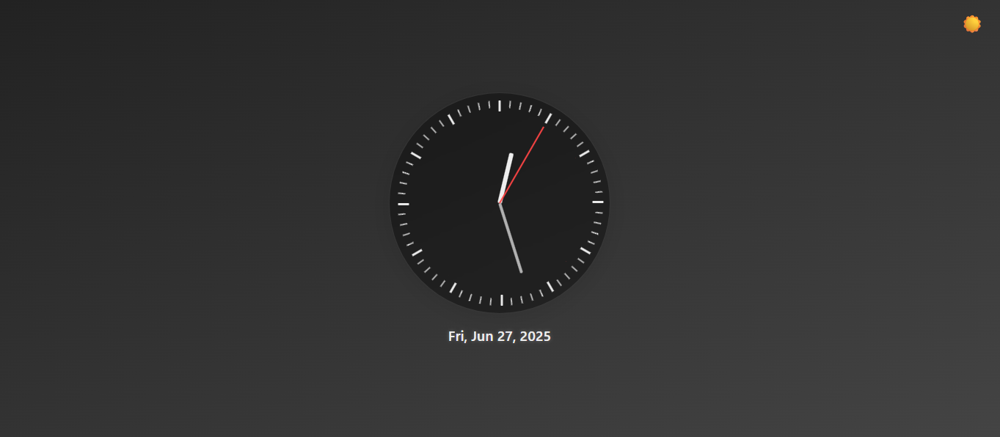
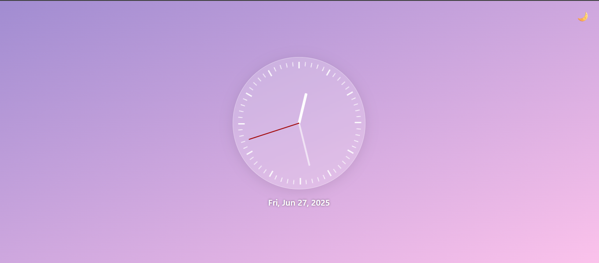

#  🕒 Analog Clock Web App


This is a modern analog clock built using **HTML**, **CSS**, and **JavaScript**, featuring a clean glassmorphism design and dark/light mode support. It's fully responsive and visually enhanced for a smooth user experience.

---

## Demo

  


---

## Features

- 🌓 **Dark/Light Mode Toggle**  
  Easily switch between light and dark themes with a toggle button.
- 🌐 **Smooth Clock Animation**  
  The clock hands move in real time with smooth transitions.
- 🗓️ **Current Date Display**  
  The current date is shown below the clock in a clean, readable format.
- 🎨 **Tick Marks for Hours and Minutes**  
  Subtle tick marks are dynamically generated to indicate time divisions.
- 📱 **Responsive Design**  
  The clock scales beautifully on smaller screens like phones and tablets.

## How to Use
1. Clone or download the repository.
2. Open `index.html` in your browser.

---

## Technologies Used

- HTML5
- CSS3 (Glassmorphism & Responsive Design)
- JavaScript (DOM Manipulation, Date API)

---

## Getting Started

### Prerequisites

- Modern web browser (Chrome, Firefox, Edge, Safari)
- Internet connection

### Setup

1. Clone the repository:

```bash
git clone https://github.com/your-username/analog_clock.git
cd analog-clock

